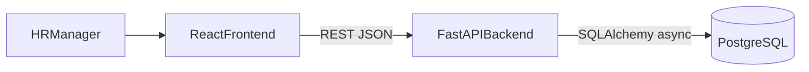
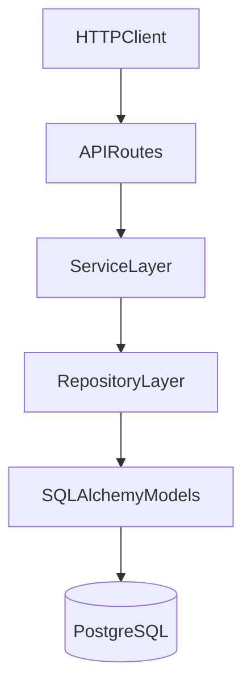
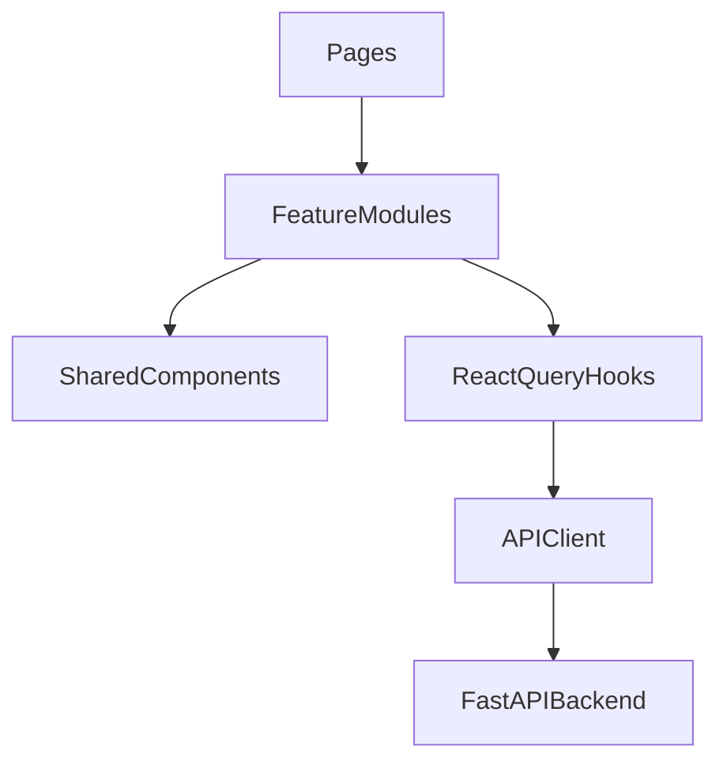

# Architecture And Trade-offs

## Overview

This document defines the system architecture for the ACME salary management tool. The application is a small, production-minded full-stack system for an HR Manager to manage 10,000 employee salary records and view compensation insights.

The design prioritizes clarity, testability, and database-side performance over unnecessary complexity.

## System Context



## Repository Structure

```text
assessment_salary_management/
  backend/
    app/
      api/              # FastAPI routers and dependency wiring
      core/             # Config, logging, exception handlers
      db/               # Session factory and base model
      models/           # SQLAlchemy ORM entities
      repositories/     # Query and persistence logic
      schemas/          # Pydantic request/response DTOs
      services/         # Business rules and transaction orchestration
    alembic/            # Database migrations
    scripts/            # Seed and maintenance scripts
    tests/              # Pytest unit and integration tests
  frontend/
    src/
      api/              # API client and React Query hooks
      components/       # Reusable UI components
      features/         # Employee and insights feature modules
      pages/            # Route-level screens
      schemas/          # Zod validation schemas
  docs/
    requirements.md
    architecture.md
    database-design.md
    api-design.md
```

## Backend Architecture

The backend uses a layered architecture so route handlers stay thin and business logic remains testable.



### Layer Responsibilities

| Layer | Responsibility |
|---|---|
| API routes | Parse HTTP input, call services, return response schemas |
| Schemas | Validate request and response payloads |
| Services | Business rules, orchestration, transaction boundaries |
| Repositories | SQLAlchemy query construction and persistence |
| Models | Database entities and relationships |
| Core | Config, logging, exception handlers, shared utilities |
| DB | Async engine, session management, Alembic integration |

### Request Flow Example

1. HR submits an employee update from the frontend.
2. FastAPI route validates input with a Pydantic schema.
3. Service checks business rules and opens a transaction.
4. Repository performs the SQL update.
5. Service commits or rolls back on failure.
6. Route returns a clean response DTO or mapped error.

## Frontend Architecture

The frontend is a single-page React application focused on two workflows:

1. Employee management
2. Salary insights dashboard



### Frontend Responsibilities

| Area | Responsibility |
|---|---|
| Pages | Route-level layout and screen composition |
| Features | Employee table/forms and insights dashboard |
| Components | Reusable table, modal, form, and loading UI |
| API hooks | React Query data fetching, caching, mutations |
| Schemas | Zod validation for forms and API payloads |

## Technology Choices

| Area | Choice | Reason |
|---|---|---|
| Backend language | Python | Strong ecosystem for FastAPI, SQLAlchemy, and testing |
| Backend framework | FastAPI | Fast to build, typed, good validation and OpenAPI support |
| Database | PostgreSQL | Better fit than SQLite for indexing, aggregation, and scale |
| ORM | SQLAlchemy 2.x | Mature async support and clear repository patterns |
| Migrations | Alembic | Standard schema versioning for PostgreSQL |
| Validation | Pydantic | Clean request/response contracts at API boundaries |
| Frontend | React + TypeScript + Vite | Simple SPA setup, fast local dev, assessment-friendly |
| Data fetching | TanStack Query | Caching, loading/error states, mutation invalidation |
| Forms | React Hook Form + Zod | Strong validation with minimal boilerplate |
| UI library | Material UI | Accessible components and fast HR-focused UI delivery |
| Testing | Pytest + Vitest/RTL | Backend behavior tests plus targeted frontend flow tests |

## Key Trade-offs

### PostgreSQL Instead Of SQLite

**Chosen:** PostgreSQL

**Why:** The assessment expects filtering, sorting, pagination, and aggregate salary analytics over 10,000 employees. PostgreSQL provides stronger indexing, aggregation performance, and a more realistic production setup.

**Trade-off:** Local setup is slightly more involved than SQLite, but Docker or a local PostgreSQL instance keeps this manageable.

### Async Database Access

**Chosen:** Async SQLAlchemy sessions for I/O-bound API work

**Why:** FastAPI is async-friendly, and database/network I/O benefits from non-blocking access under concurrent requests.

**Trade-off:** Async adds some complexity compared with sync SQLAlchemy. It is justified here because the app is API-driven and database-bound, but CPU-heavy work should remain synchronous.

### Vite Instead Of Next.js

**Chosen:** Vite + React SPA

**Why:** The app does not need SSR, SEO, or server components. Vite keeps the frontend simpler and faster to build for an internal HR tool.

**Trade-off:** Deployment is a static frontend plus separate backend API rather than a unified full-stack framework.

### Layered Backend Instead Of "Fat Routes"

**Chosen:** Routes, services, repositories, schemas

**Why:** Keeps business logic testable and makes the codebase easier to extend beyond 10,000 employees.

**Trade-off:** More files than a small demo app strictly needs, but this is appropriate for an assessment focused on engineering quality.

### No Authentication In V1

**Chosen:** No auth layer in the initial scope

**Why:** The assessment focuses on salary CRUD, insights, architecture, and testing. Auth would add middleware, user models, and security flows without improving the core evaluation.

**Trade-off:** Suitable for local/demo use only. Production would require authentication, authorization, and audit trails.

### Database-Side Analytics Instead Of In-Memory Calculation

**Chosen:** SQL `MIN`, `MAX`, `AVG`, `COUNT`, and `GROUP BY`

**Why:** Salary insights should scale cleanly and avoid loading large datasets into Python memory.

**Trade-off:** Insight logic lives partly in SQL/repository code rather than purely in Python services, but this is the correct performance trade-off.

## Error Handling Strategy

All API errors follow a consistent JSON shape:

```json
{
  "error": {
    "code": "NOT_FOUND",
    "message": "Employee not found"
  }
}
```

Handling approach:

- Validation errors: HTTP 422 with field-level details where useful
- Not found: HTTP 404 with a safe user-facing message
- Integrity/conflict errors: HTTP 409 with mapped business message
- Unexpected server errors: HTTP 500 with generic message and internal logging

Business logic raises domain exceptions; FastAPI global handlers map them to HTTP responses. Internal stack traces and database details are never returned to the frontend.

## Transaction Strategy

Transactions are used for:

- Employee create, update, and delete
- Seed script execution
- Any multi-step write operation

On exception:

1. Roll back the transaction
2. Log the error internally
3. Return a safe API response

## Performance Strategy

For 10,000 employees:

- Paginate all employee list endpoints
- Filter and sort in SQL, not in Python or the browser
- Use aggregate SQL for insights
- Bulk insert during seeding
- Add indexes for common filters and analytics paths
- Keep API payloads limited to fields needed by the UI
- Use React Query caching to reduce repeated frontend requests

Multiprocessing or multithreading is not planned for this assessment. The workload is I/O-bound and well served by async database access, SQL aggregation, and pagination.

## Testing Strategy

| Layer | What To Test |
|---|---|
| Services | Business rules and exception behavior |
| Repositories | Query correctness for filters and aggregates |
| API | CRUD integration, validation, not-found, and error mapping |
| Seed | Deterministic record count and sample data integrity |
| Frontend | Form validation, loading/error states, key user flows |

Tests use a separate test database and deterministic fixtures so results are fast and repeatable.

## Scalability Notes

The current design can grow beyond 10,000 employees without major rewrites:

- Pagination and indexed filters keep list APIs stable
- Aggregate queries remain efficient with proper indexes
- Service/repository separation allows caching or read replicas later
- Frontend stays thin by relying on backend filtering and analytics

Future extensions that would require design changes:

- Authentication and role-based access
- Multi-tenant organizations
- Payroll execution and immutable compensation history
- Real-time analytics or BI dashboards

## Verification For This Step

- Architecture aligns with `docs/requirements.md`
- Layer boundaries and technology choices are documented
- Trade-offs explain both chosen approach and rejected alternatives
- No backend or frontend implementation code has been added yet

## Proposed Commit Message

`docs: add architecture and trade-offs`
