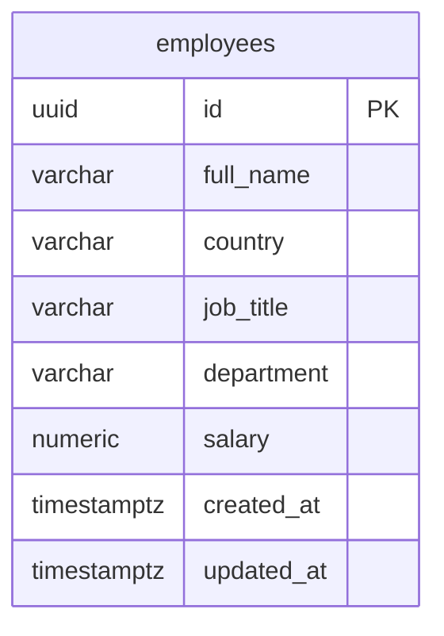

# Database Design And Indexing Strategy

## Overview

The database stores employee salary records for ACME. The schema is intentionally simple: one normalized `employees` table supports CRUD, filtering, pagination, and all required salary insight queries.

This design is sufficient for 10,000 employees and can scale further with the same table shape plus indexing and pagination.

## Entity Relationship



No additional tables are required for the assessment scope. Country, job title, and department are stored as normalized text columns rather than lookup tables.

## Table: `employees`

| Column | Type | Nullable | Description |
|---|---|---|---|
| `id` | `UUID` | No | Primary key, generated in application or database |
| `full_name` | `VARCHAR(200)` | No | Employee full name |
| `country` | `VARCHAR(100)` | No | Country code or country name used consistently in seed/UI |
| `job_title` | `VARCHAR(150)` | No | Role title, e.g. Software Engineer |
| `department` | `VARCHAR(150)` | No | Department name, e.g. Engineering |
| `salary` | `NUMERIC(12, 2)` | No | Annual salary; decimal-safe money type |
| `created_at` | `TIMESTAMPTZ` | No | Record creation timestamp |
| `updated_at` | `TIMESTAMPTZ` | No | Last update timestamp |

### DDL Sketch

```sql
CREATE TABLE employees (
    id UUID PRIMARY KEY,
    full_name VARCHAR(200) NOT NULL,
    country VARCHAR(100) NOT NULL,
    job_title VARCHAR(150) NOT NULL,
    department VARCHAR(150) NOT NULL,
    salary NUMERIC(12, 2) NOT NULL CHECK (salary > 0),
    created_at TIMESTAMPTZ NOT NULL DEFAULT NOW(),
    updated_at TIMESTAMPTZ NOT NULL DEFAULT NOW()
);
```

## Design Decisions

### Single Table Instead Of Lookup Tables

**Chosen:** One `employees` table with text columns for country, job title, and department.

**Why:** The assessment needs CRUD and aggregate insights, not master-data governance. Lookup tables would add joins and seed complexity without improving the core evaluation.

**Trade-off:** Text values must stay consistent in seed data and validation. Future production systems may introduce reference tables or enums.

### UUID Primary Keys

**Chosen:** UUID primary key

**Why:** Safe for distributed creation, avoids sequential ID leakage, and works well with API-driven CRUD.

**Trade-off:** Slightly larger indexes than integer IDs, but negligible at 10,000 rows.

### `NUMERIC(12, 2)` For Salary

**Chosen:** PostgreSQL `NUMERIC`, mapped to Python `Decimal`

**Why:** Salary values must never use floating point. `NUMERIC(12, 2)` supports values up to 9,999,999,999.99 with two decimal places.

**Trade-off:** Slightly more verbose than float types, but required for financial correctness.

### Timestamps With Time Zone

**Chosen:** `TIMESTAMPTZ`

**Why:** ACME operates across multiple countries; timezone-aware timestamps are safer for audit fields.

## Constraints

| Constraint | Purpose |
|---|---|
| `PRIMARY KEY (id)` | Unique employee identity |
| `NOT NULL` on business columns | Prevent incomplete salary records |
| `CHECK (salary > 0)` | Reject zero or negative salaries |
| Application-level validation | Enforce string length and allowed sort fields |

Unique constraints on `(full_name, country, job_title)` are intentionally omitted. Real HR systems may allow duplicate names, and the assessment does not require deduplication rules.

## Index Strategy

Indexes are chosen for the actual query paths in requirements: employee list filtering and salary analytics.

| Index | Columns | Supports |
|---|---|---|
| `pk_employees` | `id` | Primary key lookups, update/delete by ID |
| `ix_employees_country` | `country` | Filter by country, group by country insights |
| `ix_employees_job_title` | `job_title` | Filter by job title, average by job title |
| `ix_employees_country_job_title` | `country, job_title` | Combined filter and avg salary for job title in country |
| `ix_employees_department` | `department` | Average salary by department |

### Index Rationale

#### `ix_employees_country`

Used by:

- Employee list filter: `WHERE country = ?`
- Insights: min/max/avg salary by country
- Insights: employee count by country
- Insights: salary range by country

At 10,000 rows, PostgreSQL can group efficiently with an index on the grouping column.

#### `ix_employees_job_title`

Used by:

- Employee list filter: `WHERE job_title = ?`
- Insights: average salary by job title

#### `ix_employees_country_job_title`

Used by:

- Combined employee filters: `WHERE country = ? AND job_title = ?`
- Insight: average salary for a job title within a country

This composite index is the most important filter index because HR will often inspect a role within a specific country.

#### `ix_employees_department`

Used by:

- Insight: average salary by department

### Indexes Not Added

| Candidate | Why omitted |
|---|---|
| Index on `salary` alone | Aggregate min/max/avg are usually grouped by country or title; a standalone salary index adds write overhead with limited benefit at 10k rows |
| Full-text index on `full_name` | Requirements focus on country and job title filters; optional name search can use `ILIKE` acceptably at this scale |
| Unique index on natural keys | No deduplication requirement in scope |

## Query Patterns

### 1. Paginated Employee List

```sql
SELECT id, full_name, country, job_title, department, salary, created_at, updated_at
FROM employees
WHERE country = :country
  AND job_title = :job_title
ORDER BY full_name ASC
LIMIT :page_size OFFSET :offset;
```

**Expected performance:** Index scan on `ix_employees_country_job_title`, then sort/limit. With page size 20-50, response time should remain low and stable.

**Count query:**

```sql
SELECT COUNT(*)
FROM employees
WHERE country = :country
  AND job_title = :job_title;
```

Uses the same filter path without loading all rows into memory.

### 2. Min / Max / Avg Salary By Country

```sql
SELECT
    country,
    MIN(salary) AS min_salary,
    MAX(salary) AS max_salary,
    ROUND(AVG(salary), 2) AS avg_salary,
    COUNT(*) AS employee_count
FROM employees
GROUP BY country
ORDER BY country;
```

**Expected performance:** Sequential scan or index-assisted aggregation over 10,000 rows is fast in PostgreSQL. Result set is small (one row per country).

### 3. Average Salary For Job Title In Country

```sql
SELECT ROUND(AVG(salary), 2) AS avg_salary
FROM employees
WHERE country = :country
  AND job_title = :job_title;
```

**Expected performance:** `ix_employees_country_job_title` narrows the scanned row set before aggregation.

### 4. Average Salary By Department

```sql
SELECT
    department,
    ROUND(AVG(salary), 2) AS avg_salary,
    COUNT(*) AS employee_count
FROM employees
GROUP BY department
ORDER BY department;
```

**Expected performance:** Efficient grouped aggregation; output size equals number of departments.

### 5. Average Salary By Job Title

```sql
SELECT
    job_title,
    ROUND(AVG(salary), 2) AS avg_salary,
    COUNT(*) AS employee_count
FROM employees
GROUP BY job_title
ORDER BY job_title;
```

**Expected performance:** Uses `ix_employees_job_title` where beneficial; still fast at assessment scale.

### 6. Single Employee CRUD

```sql
-- Read
SELECT * FROM employees WHERE id = :id;

-- Update
UPDATE employees
SET full_name = :full_name,
    country = :country,
    job_title = :job_title,
    department = :department,
    salary = :salary,
    updated_at = NOW()
WHERE id = :id;
```

**Expected performance:** Primary key lookup and update are O(1) index operations.

## Sorting Rules

Allowed sort fields should be whitelisted in the repository/service layer:

- `full_name`
- `country`
- `job_title`
- `department`
- `salary`
- `created_at`
- `updated_at`

Default sort: `full_name ASC`.

Dynamic SQL must never interpolate unchecked user sort fields.

## Seeding Strategy

The seed script will insert 10,000 deterministic employees using bulk insert batches inside one transaction.

Recommended approach:

- Batch size: 500 to 1000 rows per insert
- Deterministic data generation from fixed country/job title/department lists
- Salary values generated from bounded ranges per country or role
- Roll back entire seed if any batch fails

Example shape:

```sql
INSERT INTO employees (
    id, full_name, country, job_title, department, salary, created_at, updated_at
)
VALUES
    (...),
    (...);
```

**Expected performance:** Bulk insert of 10,000 rows should complete in seconds. Indexes may slow inserts slightly, but the total seed time remains acceptable for local development.

## Memory And Query Execution Rules

- Never `SELECT * FROM employees` without pagination for API list endpoints
- Never compute insight aggregates in Python over full-table fetches
- Use `COUNT(*)` in SQL for pagination totals
- Round display values in SQL or service layer before returning to UI
- Keep repository methods focused so each query has one clear purpose

## Test Database Strategy

- Use a separate PostgreSQL database for tests, e.g. `salary_management_test`
- Truncate or recreate schema between test modules as needed
- Seed small deterministic fixtures for insight assertions
- Validate exact aggregate outputs, not just "non-null" responses

## Future Schema Extensions

If the product grows beyond the assessment:

- Add `organizations` for multi-tenant support
- Add lookup tables for countries, departments, and job titles
- Add `compensation_history` for immutable salary change audit
- Add materialized views for heavy analytics dashboards
- Add partial indexes only after measuring real query plans

## Verification For This Step

- Schema supports all required employee fields and salary insight queries
- Column types are appropriate for UUID, money, text, and timestamps
- Indexes map directly to filter and analytics use cases
- Query examples explain expected performance at 10,000 rows
- No backend models or migrations have been implemented yet

## Proposed Commit Message

`docs: add database design and indexing strategy`
